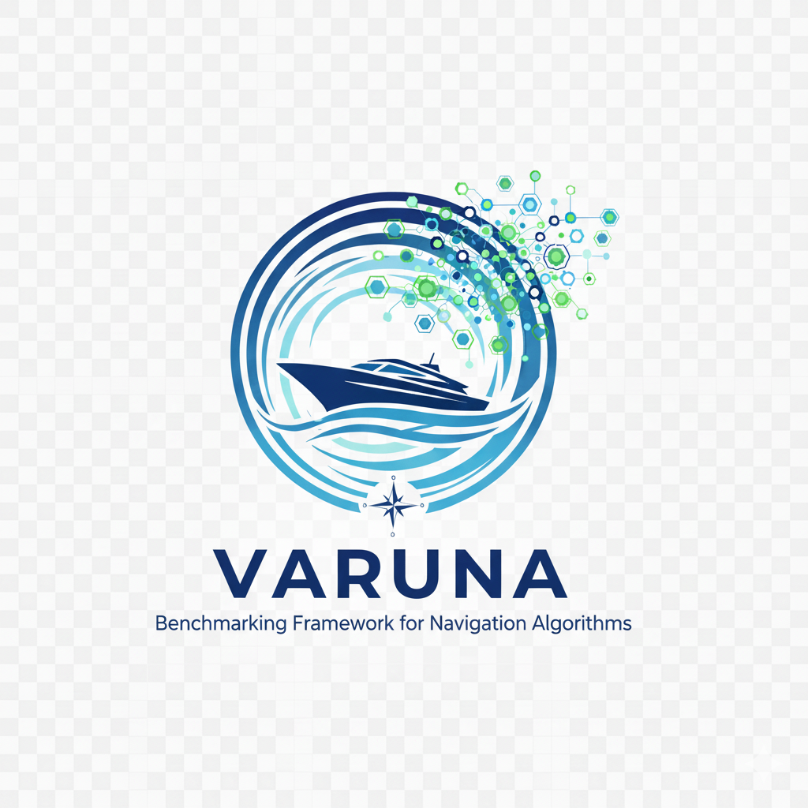

  

# VARUNA: A Modular Benchmarking Framework for Marine Navigation

> Standardized, extensible experiments for marine navigation under ocean currents, starting from the classical **Zermelo** problem.

## Overview
Autonomous marine navigation spans route planning in dynamic environments, compliance with COLREGs, obstacle avoidance, multi-vehicle coordination, and decision-making under uncertainty. Environmental disturbances—currents, wind, and waves—and the trade-offs among travel time, safety, energy, and robustness highlight the need for **standardized and reproducible** benchmarks.  
**VARUNA** is an open-source, **modular** and **extensible** framework that starts from the Zermelo problem and scales to richer settings. It is explicitly oriented toward reproducible results and easy extensibility: datasets and configurations are standardized for like-for-like comparisons, and a clear solver interface allows optimization- and learning-based methods to be added as plug-ins with minimal effort. All solvers run under a common benchmark protocol, enabling fair, repeatable evaluations.

---

## Supported Problems

- **Zermelo (baseline)** — Time-optimal navigation at constant speed within a flow field, with a standardized setup enabling fair, repeatable comparisons of solution methods.  
  → See **[README_ZERMELO.md](./README_ZERMELO.md)** for detailed problem definition, implemented solvers, and usage examples.

- **Planning (Zermelo extensions)** — *Under construction*  
  Roadmap items include realistic ship geometries, time-varying/data-driven current fields, obstacle representations, adaptive time-stepping, coupled ship/wind/wave dynamics with trajectory tracking, and energy-aware metrics.

---

## Quick Start

1) **Run the Zermelo baseline** (single instance; compare active solvers)

    python run_problem.py

    # Config: code/problems/problems.py
    # -----------------------------------------------------------------------
    # PROBLEM_NAME: 'zermelo'
    # SCENARIO_TYPE: 'random'   # {'fixed', 'random'}
    # CURRENT_TYPE: Optional[str] = None  # None => sample from:
    #   ["uniform","sinusoidal","logarithmic","gaussianSwirl","vortex",
    #    "karmanVortex","coastalTidal","linearShear","doubleGyre",
    #    "gaussianJet","riverOutflow","turbulenceNoise"]
    # SIZE_ID: 1  # {1:200x200, 2:2000x2000, 3:20000x20000}
    # MASTER_SEED: Optional[int] = None  # set int for reproducibility

2) **Run batch simulations** (build the benchmark database)

    python run_simulations.py

    # Config: code/run_simulations.py
    # -----------------------------------------------------------------------
    # PROBLEM_NAME: "zermelo"
    # SCENARIO_TYPE: "random"  # new scenario per sim if 'random'
    # MASTER_SEED: Optional[int] = 1  # None => random
    # NUM_SIMULATIONS: 1000      # per scenario & current
    #
    # SIZES_ID: Optional[Iterable[int]] = None   # e.g., [1]; None => all
    # CURRENTS_ID: Optional[Iterable[int]] = None  # None => all (0..11)
    #
    # DATABASE_FILE: os.path.abspath(os.path.join(DATA_PATH,"zermelo","zermelo.db"))
    # DB_RESET: True            # clear DB before running
    # PARALLEL_EXECUTION: True  # enable parallel sims

3) **Generate reports** (tables/figures for manuscripts)

    python report_simulations.py

---

## Extending Solvers (Zermelo)

1) **Create a solver module**
    
    problems/zermelo/solvers/<your_solver_name>/
      ├── __init__.py
      └── solver.py

2) **Register the solver**
    
    problems/zermelo/problems.py
    # Add to AVAILABLE_SOLVERS:
    #   - "solve": callable
    #   - "meta":  dict (name, deterministic, params)

3) **Implement the minimal interface**

    # problems/zermelo/solvers/<your_solver_name>/solver.py
    from typing import Dict, Any
    import numpy as np

    METADATA: Dict[str, Any] = {
        "name": "YourSolver",
        "deterministic": True,   # or False
        "params": {"max_steps": 10_000, "time_step": 0.1},
    }

    def control(t: float, x: np.ndarray, problem, **kwargs):
        # Return control (e.g., heading or rate).
        return 0.0  # placeholder

    def solve(problem, **kwargs):
        # Use problem.simulate(...) to standardize outputs.
        return problem.simulate(
            sim_id=METADATA["name"],
            state=problem.initial_state,
            max_steps=kwargs.get("max_steps", METADATA["params"]["max_steps"]),
            time_step=kwargs.get("time_step", METADATA["params"]["time_step"]),
            max_execution_time=kwargs.get("max_execution_time", None),
            controller=lambda t, x: control(t, x, problem, **kwargs),
        )

4) **Required outputs** (for fair comparisons)

    # Must return (directly or via simulate):
    simulation_data = {
        "id": str,
        "time_step": float,
        "num_steps": int,
        "goal_objective": (float, float),
        "total_time": float,
        "total_distance": float,
        "last_state": np.ndarray,
        "distance_to_goal": float,
        "time_history": np.ndarray,
        "states_history": np.ndarray,
        "controls_history": np.ndarray,
        "disturbance_history": np.ndarray,
        "state_derivatives_history": np.ndarray,
        "navigation_index": float
    }

---

## Reproducibility Notes

- Use a fixed `MASTER_SEED` for pseudo-randomness in scenarios and (if applicable) solvers.
- Keep `SCENARIO_TYPE`, `SIZE_ID`, and `CURRENT_TYPE` consistent when comparing methods.
- All solvers run under the same protocol (identical scenarios, step sizes, stopping criteria) to ensure like-for-like, repeatable evaluations.

---
